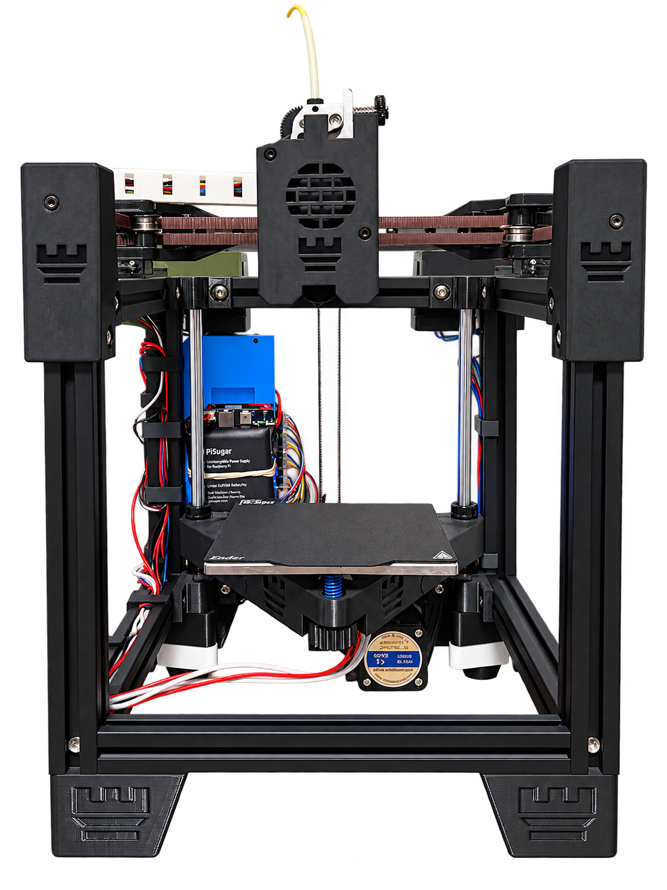
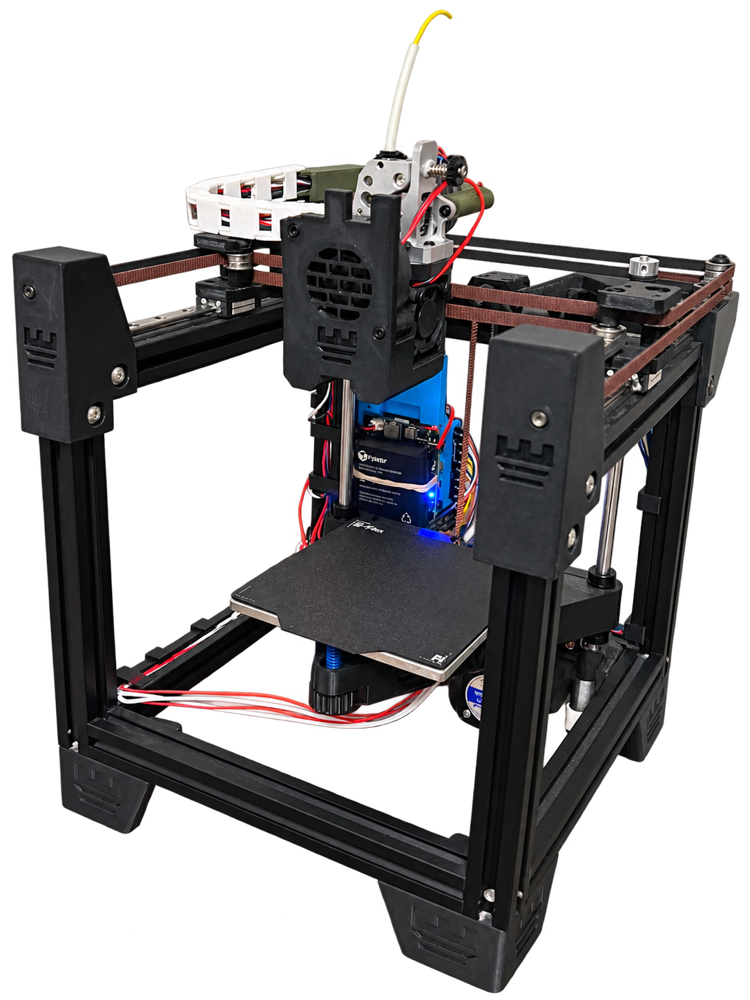
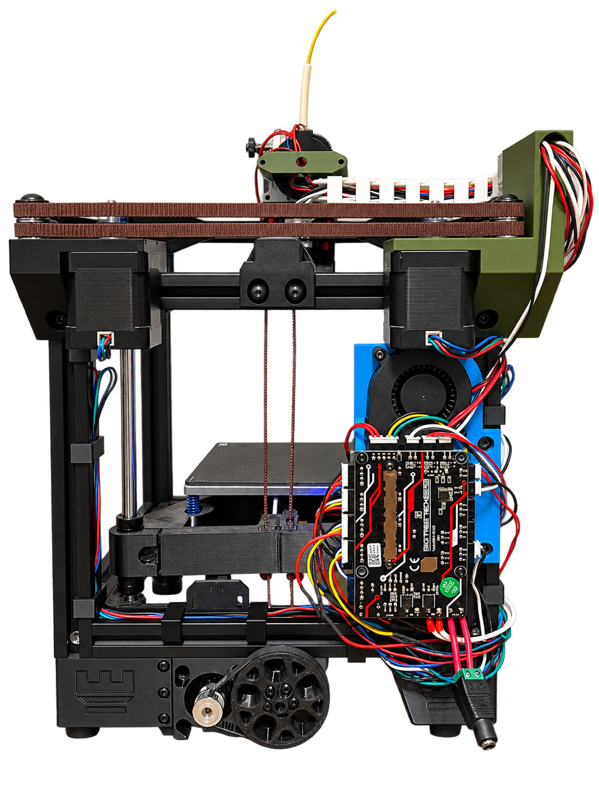

# Rook 2020 MK2 build

Steven Kim's build of the Rook 2020 MK2, Rolohaun Design's small CoreXY 3D
printer on a 2020 extrusion frame with a 120 x 120 mm bed. The controller is a
BTT SKR Pico running Klipper, with Mainsail on a Raspberry Pi host; X and Y home
sensorlessly, and the toolhead is an HDX-Lite direct-drive extruder with a
Bambu X1 hotend.

This repo holds what is needed to continue or reproduce the build from another
machine: the Klipper configuration, the parts list, the CAD assembly (as a
GitHub Release asset), and build photos.

<p>



</p>

The three views are my phone photos with the background removed. The hardware
is as built; do not rely on any fine label text in them.

1. Front view: 2020 frame with printed corner blocks, the toolhead centered on
   the X gantry, the bed on the Z axis, and the Raspberry Pi mounted behind the
   bed.
2. Side view: BTT SKR Pico mounted on the side of the frame, the cable chain to
   the toolhead, the power inlet at the bottom, and the printed large pulley of
   the geared Z drive on the Z motor.
3. Three-quarter view: direct-drive toolhead with filament loaded, printed fan
   shroud, X rail and belts, and the textured flex plate on the bed.

## Layout

| Path | Contents |
|---|---|
| `klipper/printer.cfg` | Klipper configuration (goes to `~/printer_data/config/printer.cfg` on the Pi) |
| `cad/README.md` | Where to get the CAD assembly and what is in it; the 170 MB STEP itself is a Release asset |
| `bom/BOM.md` | Parts list, attributed to the upstream BOM |
| `docs/images/` | Build photos (front, side, back), background removed |
| `LICENSE` | CC BY-NC 4.0 for CAD/BOM/photos, MIT for the rest |

## Build summary

| | |
|---|---|
| Kinematics | CoreXY, 2020 extrusion frame (11 x 200 mm) |
| Print area | 120 x 120 x ~92 mm |
| Motion | MGN9C rails (2 x 200 mm Y, 1 x 150 mm X), GT2 6 mm belts, 20T pulleys; Z on 8 mm rods + leadscrew (8 mm/rev) |
| Board / host | BTT SKR Pico (TMC2209 x 4 over shared UART) + Raspberry Pi via `/dev/serial0` |
| Homing | X/Y sensorless (StallGuard), Z mechanical endstop at the top of travel |
| Extruder | HDX-Lite direct drive, 9.5:1, Bambu X1 hotend, 0.4 mm nozzle |
| Bed | Funssor Rook bed, 100 x 100 heater, 3-point screw levelling |
| Power | 24 V 8 A |
| Fans | 5015 part cooling, 3010 hotend, plus a fixed 40 % auxiliary fan |

## What is different from stock, and where the work went

The upstream BOM offers a few options; this build takes the direct-drive
HDX-Lite plus Bambu X1 hotend rather than the Bowden BMG, and the SKR Pico
rather than the SKR Mini E3 v3. The CAD assembly still carries a Sherpa Mini and
a CR10-style hotend as placeholder toolhead geometry, so it does not match what
is on the printer (see `cad/README.md`).

Most of the effort visible in this repo is in `klipper/printer.cfg`:

- Sensorless X/Y homing on the TMC2209s. The two axes ended up with different
  StallGuard thresholds (`driver_SGTHRS` 50 on X, 115 on Y), the `_HOME_X` /
  `_HOME_Y` macros drop run current to 0.70 A while homing and restore it
  afterwards, and X/Y run SpreadCycle (`stealthchop_threshold: 0`) with
  `homing_retract_dist: 0`, all of which StallGuard homing needs.
- The Z endstop sits at the top of travel, so `[homing_override]` homes Z
  first, then X, then Y. The Z coordinate system was shifted by 27.5 mm from an
  earlier configuration so that the bed surface is Z = 0
  (`position_endstop` = `position_max` = 92.5).
- X/Y `position_max` is deliberately the 120 mm bed, not the ~200 mm frame;
  actual hard-stop travel has not been measured.
- A spare fan output (gpio20) is used as a fixed 40 % always-on fan through
  `[output_pin always_on_fan]`.
- All four TMC2209s share one UART (gpio9/gpio8) and are addressed 0 = X,
  2 = Y, 1 = Z, 3 = extruder.

## How to use

Clone the repo:

```sh
git clone https://github.com/stekimboy/rook-mk2-build.git
```

Firmware and host:

1. Install Klipper and Mainsail on the Raspberry Pi and flash Klipper to the
   SKR Pico following Klipper's official documentation
   (https://www.klipper3d.org/Installation.html) and the board's own docs. The
   exact steps used for this build were not recorded here.
2. Copy `klipper/printer.cfg` to `~/printer_data/config/printer.cfg` on the Pi.
   It `[include]`s `mainsail.cfg`, which the Mainsail install provides on the
   Pi; it is not in this repo.
3. The `[mcu]` section expects the Pico on the Pi's UART at `/dev/serial0`.
   If the board is connected over USB instead, change `serial` accordingly.
4. Restart Klipper (`RESTART` / `FIRMWARE_RESTART` in Mainsail) and read any
   config error it reports. There is no other validation tooling.

Slicer start g-code: `PRINT_START BED=[bed_temperature] EXTRUDER=[temperature]`.
There is no `PRINT_END` macro yet. `PARK` moves to the bed center and `CHOME`
homes only axes that are not already homed.

CAD: download `My-Rook.step` from the Releases page
(https://github.com/stekimboy/rook-mk2-build/releases). Details in
`cad/README.md`.

Before editing the config, read the comments in it; several values
(X/Y limits, Z endstop position, homing order, the tuned PID values) are easy
to break.

## Results and limitations

This repo records the configuration, not print results. No print samples,
dimensional checks, or measured values are stored here.

- Hotend and bed PID values in `printer.cfg` are tuned. Extruder
  `rotation_distance` (53.0 with a 9.5:1 gear ratio) is not calibrated yet.
- `pressure_advance` is set to 0.06; whether it was tuned is not recorded.
- No input shaper / resonance data.
- Real X/Y travel beyond the bed has not been measured, so the config exposes
  only the 120 x 120 mm bed.
- The CAD toolhead does not match the built toolhead.

## Status / TODO

- [ ] Calibrate extruder `rotation_distance`
- [ ] Add `PRINT_END` macro
- [ ] Measure real XY travel beyond bed and decide whether to expose non-printing travel
- [ ] Input shaper / resonance tuning

## Attribution and license

This is a build of the Rook 2020 MK2 by Rolohaun Design (Kanrog), published
under CC BY-NC 4.0 at https://www.printables.com/model/798733-rook-2020-mk2.
The CAD, BOM, and photos in this repo are derivative of that design and are
shared under the same CC BY-NC 4.0 license. The Klipper configuration and
everything else is MIT, Copyright (c) 2026 Steven Kim. See `LICENSE`.
